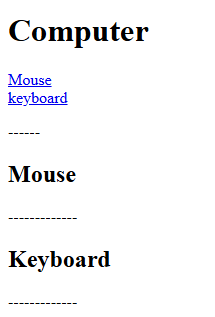
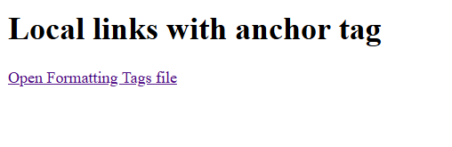

[Back to home](README.md)
# External Anchor Tag

**File name:** externalAnchorTag.html
```html
<!DOCTYPE html>
<html>
    <head>
        <title>Anchor tag</title>
    </head>
    <body>
        <h1>Google</h1>
        <a href="https://www.google.com" target="blank">Click Here</a>
    </body>
</html>
```


## Output


# Internal(Same page) Anchor Tag

**File name:** internalAnchorTag.html
```html
<!DOCTYPE html>
<html>
    <head>
        <title>Internal(Same Page) Anchor Tag</title>
    </head>
    <body>
        <h1>Computer</h1>

        <a href="#mouse">Mouse</a><br>
        <a href="#kb">keyboard</a>
        <p>------</p>

        <h2 id="mouse">Mouse</h2>
        <p>-------------</p>

        <h2 id="kb">Keyboard</h2>
        <p>-------------</p>
</body>
</html>
```


## Output


# Local Link Anchor Tag

**File name:** localAnchorTag.html
```html
<!DOCTYPE html>
<html>
    <head>
        <title>Local Link with anchor tag</title>
    </head>
    <body>
        <h1>Local links with anchor tag</h1>
        <a href="formattingTags.html">Open Formatting Tags file</a><br>
    </body>
</html>
```


## Output



[Back to home](README.md)
