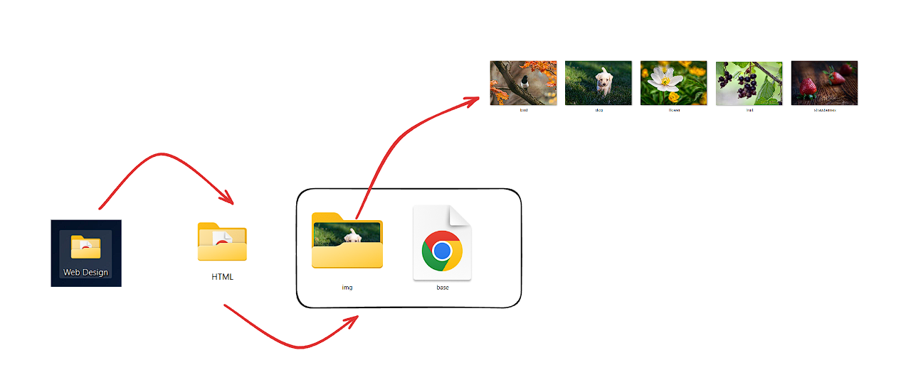
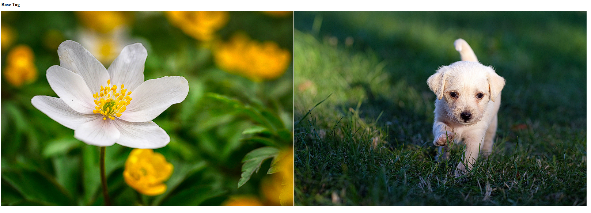

[Back to home](README.md)


### Link for Used images in webpage

- [Dog image](images/dog.jpg)
- [Flower image](images/flower.jpg)

### Folder Structure


**File name:** base.html
```html

<!DOCTYPE html>
<html>
    <head>
        <title>Base Tag</title>
        <base href="img/">
    </head>

    <body>
        <h1>Base Tag</h1>
        
        
    </body>
</html>

```
## Output


[Back to home](README.md)
