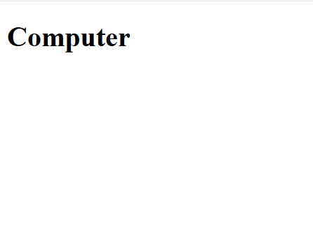

[Back to home](README.md)
# Comment HTML

**File name:** commnet.html
```html

<!DOCTYPE html>
<html>
    <head>
        <title>Comment Tag</title>
    </head>
    <body>
        <!-- This is line is for heading -->
        <h1>Computer</h1>
        <!-- <p>This is a paragraph</p> -->
    </body>
</html>
```


## Output


[Back to home](README.md)
