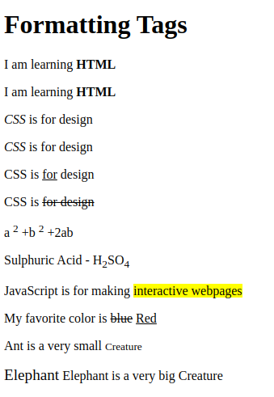

[Back to home](README.md)
# Formatting Tags
**File name:** formattingTags.html
```html

<!DOCTYPE html>
<html>
    <head>
        <title>Formatting Tags</title>
    </head>
    <body>
        <h1>Formatting Tags</h1>
        <p>I am learning <b>HTML</b></p>
        <p>I am learning <strong>HTML</strong></p>

        <p><i>CSS</i> is for design</p>
        <p><em>CSS</em> is for design</p>

        <p>CSS is <u>for</u> design</p>
        <p>CSS is <strike>for design</strike></p>


        <p>a <sup>2</sup> +b <sup>2</sup> +2ab</p>
        <p>Sulphuric Acid - H<sub>2</sub>SO<sub>4</sub></p>

        <p>JavaScript is for making <mark>interactive webpages</mark></p>

        <p>My favorite color is <del>blue</del> <ins>Red</ins></p>

        <p>Ant is a very small <small>Creature</small></p>
        <p><big>Elephant</big> Elephant is a very big Creature</p>


    </body>
</html>
```


## Output


[Back to home](README.md)
