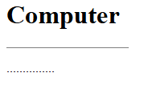

[Back to home](README.md)
# hr Tag

**File name:** hrTag.html
```html
<!DOCTYPE html>
<html>
    <head>
        <title>HR - Horizontal Rule</title>
    </head>
    <body>
        <h1>Computer</h1>
        <hr width="150px" align="left"  size ="1px" noshade>
        <p>...............</p>
    </body>
</html>
```


## Output


[Back to home](README.md)
