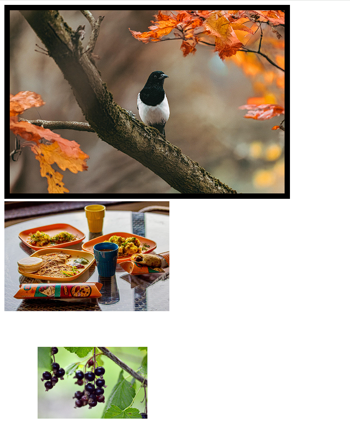

[Back to home](README.md)
# img Tag

**File name:** imgTag.html
```html
<!DOCTYPE html>
<html>
    <head>
        <title>Img tag</title>
    </head>
    <body>
        <br>
         <br>
        

    </body>
</html>
```


## Output


[Back to home](README.md)
