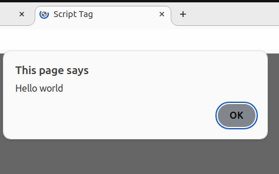

[Back to home](README.md)
# Script Tag

**File name:** scriptTag.html
```html
<!DOCTYPE html>
<html>
    <head>
        <title>Script Tag</title>
    </head>
    <body>
        <script>
            alert("Hello world");
        </script>
    </body>
</html>
```


## Output


[Back to home](README.md)
