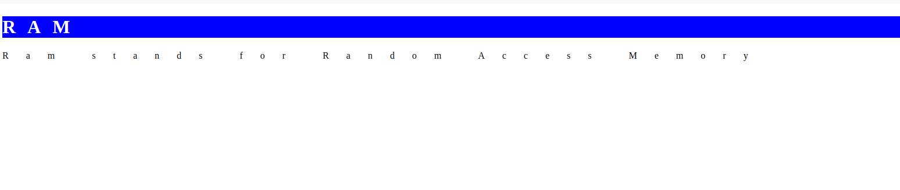

[Back to home](README.md)
# Style Tag

**File name:** styleTag.html
```html

<!DOCTYPE html>
<html>
    <head>
        <title>Style Tag</title>
        <style>
            h1{
                background-color: blue;
                letter-spacing: 20px;
                color: white;
            }
            p{
                letter-spacing: 30px;
            }
        </style>
    </head>
    <body>
        <h1>RAM</h1>
        <p>Ram stands for Random Access Memory</p>
    </body>
</html>
```


## Output


[Back to home](README.md)
