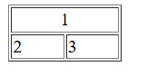

[Back to home](table.md)
# Colspan

**File name:** colspan3.html
```html
<!DOCTYPE html>
<html>
    <head>
        <title>Colspan 1</title>
    </head>
    <body>
        <table border="1" width="100px">
            <tr>
                <td align="center" colspan="2">1</td>
            </tr>
            <tr>
                <td>2</td>
                <td>3</td>
            </tr>
        </table>
    </body>
</html>
```


## Output


[Back to home](table.md)
