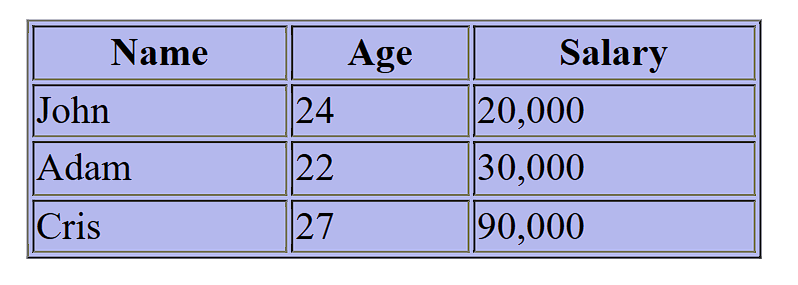

[Back to home](README.md)
# Table Tag

**File name:** tableTag1.html
```html

<!DOCTYPE html>
<html >
    <head>
        <title>Table Tag</title>
    </head>
    <body>
        <table border="1" align="center" bgcolor="#B4B8ED" width="300px">
            <tr>
                <th>Name</th>
                <th>Age</th>
                <th>Salary</th>
            </tr>
            <tr>
                <td>John</td>
                <td>24</td>
                <td>20,000</td>
            </tr>
            <tr>
                <td>Adam</td>
                <td>22</td>
                <td>30,000</td>
            </tr>
            <tr>
                <td>Cris</td>
                <td>27</td>
                <td>90,000</td>
            </tr>
        </table>
    </body>
</html>
```


## Output


[Back to home](README.md)
