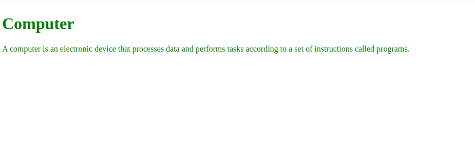

[Back to home](README.md)
# text attribute

**File name:** textAttribute.html
```html
<!DOCTYPE html>
<html>
    <head>
        <title>Attribute of body tag</title>
    </head>
    <body text="green">
       <h1>Computer</h1>
       <p>A computer is an electronic device that processes data and performs tasks according to a set of instructions called programs. </p>
    </body>
</html>
```


## Output


[Back to home](README.md)
