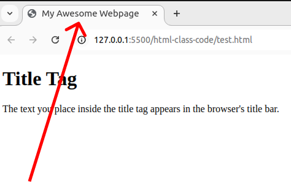

[Back to home](README.md)
# Title Tag

**File name:** titleTag.html
```html
<!DOCTYPE html>
<html>
	<head>
		<title>Title Tag</title>
	</head>
	<body>
	    <h1>Title Tag</h1>
        <p>What you write inside in title tag it will show at the title bar</p>
	</body>
</html>
```


## Output


[Back to home](README.md)
