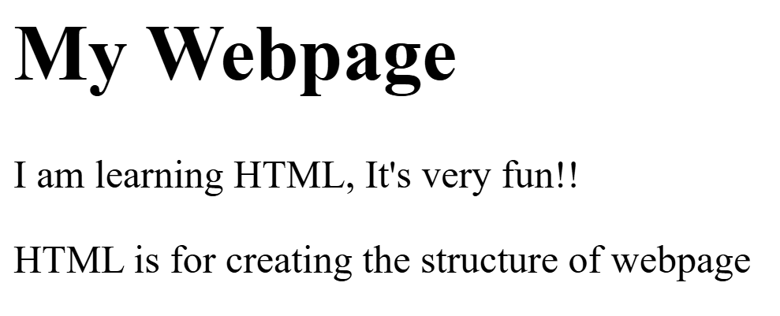

File name: [first.html]()
```html


<!DOCTYPE html>
<html>
	<head>
		<title>My First Webpage</title>
	</head>
	<body>
		<h1>My Webpage</h1>
		<p>I am learning HTML, It's very fun!!</p>
		<p>HTML is for creating the structure of webpage</p>
	</body>
</html>

```
## Output
